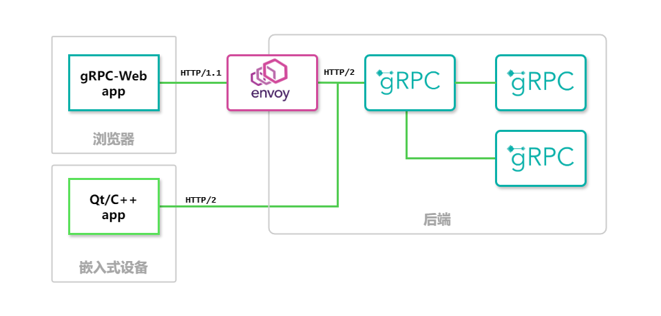

# ArmFaceID-Project

一个集`grpc`后端、`grpc-web`前端和`Qt`嵌入式设备前端的人脸身份识别系统，由以下项目组成：

 

 

- `ArmFaceID-client`: 使用 `Qt` 搭建的前端应用，提供人脸识别功能；
- `ArmFaceID-server`：使用 `gRPC` 的 `cpp` 后端应用，提供人脸识别、身份注册接口；
- `ArmFaceID-client`: 使用 `Qt` 搭建的前端应用，提供人脸识别功能；
- `ArmFaceID-registration-site`：使用 `gRPC-web`、`Vue3`、`Typescript`、`Element Plus`搭建的 Web 前端，提供身份注册功能；

